# Arquitetura & Fluxo do Agent

Esta página fornece diagramas visuais explicando como o DPL Agent funciona internamente.

---

## Arquitetura de Alto Nível

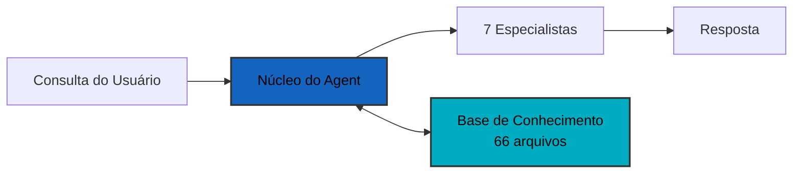

**Componentes:**
- **Núcleo do Agent**: Orquestração LangGraph + sistema RAG
- **7 Especialistas**: Troubleshooter, Bug Resolver, Performance, Quality, Commander, Ecosystem, Coordinator
- **Base de Conhecimento**: 66 arquivos markdown com documentação DPL

---

## Fluxo de Execução do Agent

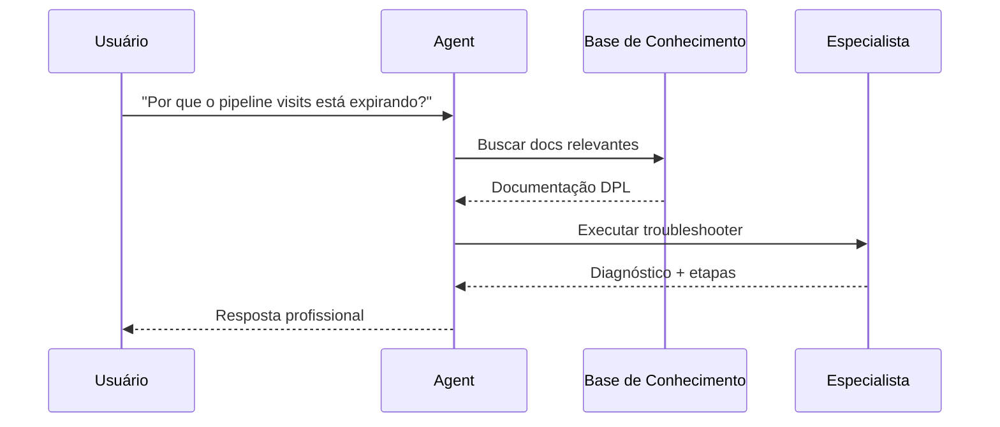

**Etapas:**
1. Usuário faz pergunta
2. Agent busca base de conhecimento por contexto
3. Agent seleciona e executa especialista apropriado
4. Especialista fornece diagnóstico com fontes
5. Agent retorna resposta formatada

---

## Sistema RAG (Recuperação de Conhecimento)

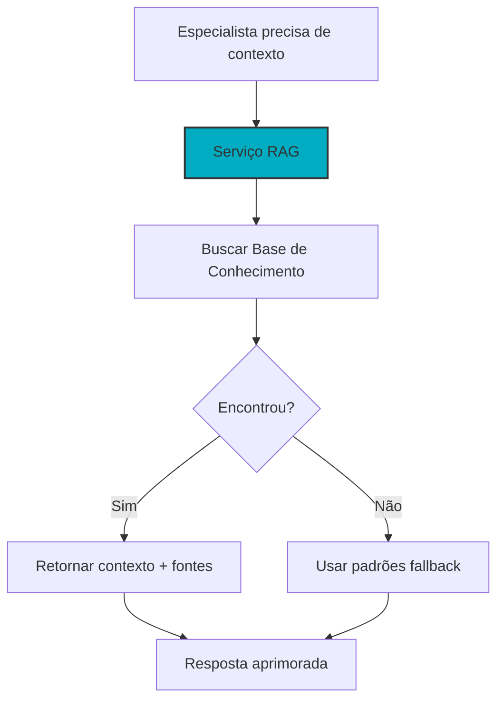

**Como funciona:**
- Especialistas consultam o serviço RAG para documentação relevante
- RAG busca 66 arquivos markdown usando busca semântica
- Retorna contexto com fontes se encontrado
- Volta para padrões hardcoded se não encontrado

---

## Camadas de Arquitetura Limpa

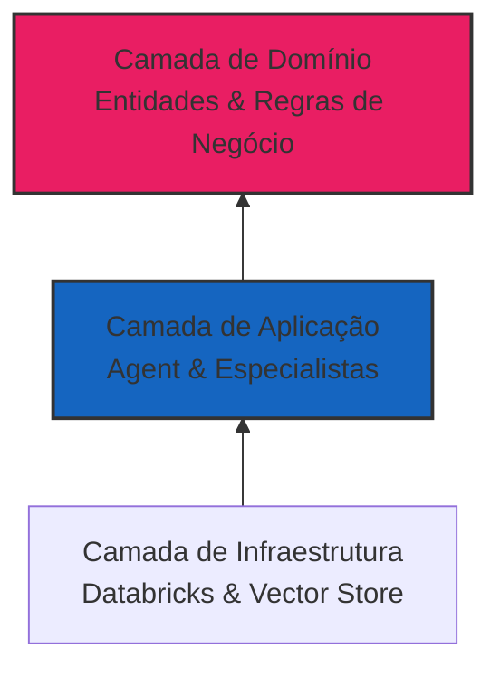

**Camadas (Interna para Externa):**
1. **Domínio**: Lógica de negócio central (entidades DPL, workflows)
2. **Aplicação**: Orquestração do agent, especialistas, RAG
3. **Infraestrutura**: Sistemas externos (Databricks, Claude, ChromaDB)

**Regra**: Dependências fluem apenas para dentro (camadas externas dependem das internas)

---

## Processo de Execução do Especialista

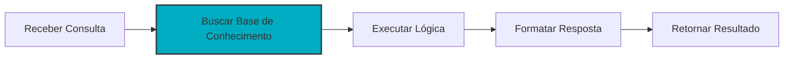

**Processo:**
1. **Receber Consulta**: Obter pergunta do usuário
2. **Buscar BC**: Encontrar documentação relevante (RAG)
3. **Executar Lógica**: Aplicar expertise do especialista
4. **Formatar**: Saída profissional e estruturada
5. **Retornar**: De volta ao núcleo do agent

---

## Estados do Workflow do Agent

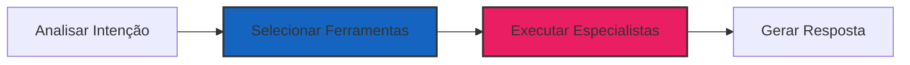

**Estados:**
- **Analisar**: Entender objetivo do usuário (troubleshooting? otimização?)
- **Selecionar**: Escolher especialistas apropriados
- **Executar**: Executar especialistas selecionados em paralelo se necessário
- **Gerar**: Criar resposta final formatada

---

## Seleção de Ferramenta por Intenção

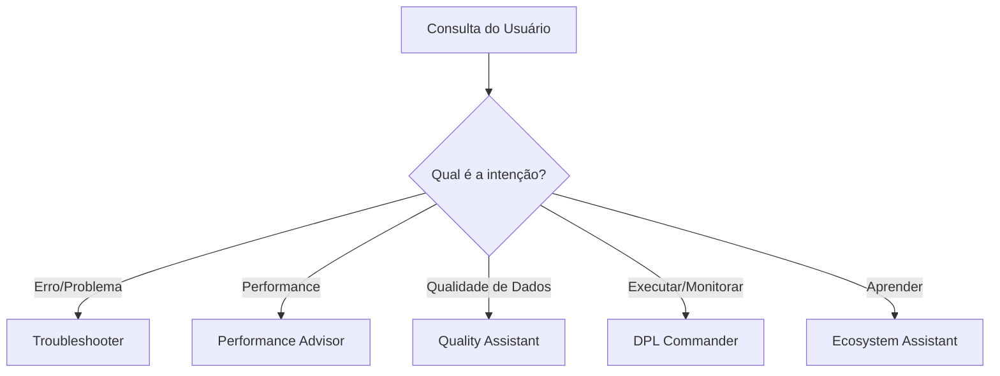

**Categorias de Intenção:**
- **Erro/Problema**: Usa Troubleshooter + Bug Resolver
- **Performance**: Usa Performance Advisor
- **Qualidade de Dados**: Usa Quality Assistant
- **Executar/Monitorar**: Usa DPL Commander
- **Aprender/Explicar**: Usa Ecosystem Assistant

---

## Memória de Conversa

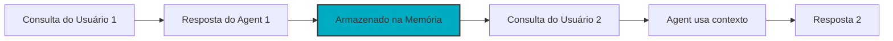

**Como a Memória Funciona:**
- Cada conversa tem um `session_id`
- Agent armazena todas as interações no SQLite
- Perguntas de acompanhamento usam contexto anterior
- Permite conversas multi-turno

---

## Resumo dos 7 Especialistas

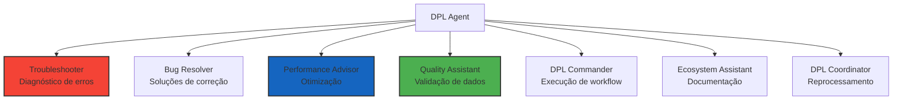

**Todos os 7 Especialistas:**
1. **Troubleshooter**: Diagnosticar erros e problemas
2. **Bug Resolver**: Fornecer correções passo a passo
3. **Performance Advisor**: Otimizar performance de pipeline
4. **Quality Assistant**: Validar qualidade de dados
5. **DPL Commander**: Executar e monitorar workflows
6. **Ecosystem Assistant**: Explicar componentes DPL
7. **DPL Coordinator**: Coordenar cenários de reprocessamento

---

## Deploy no Databricks

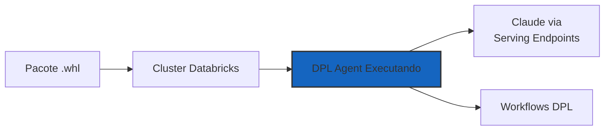

**Etapas de Deploy:**
1. Build do pacote `.whl` (data_pipeline_agent_lib-3.1.0)
2. Upload para cluster Databricks
3. Import e uso em notebooks
4. Agent usa endpoints Claude do Databricks
5. Interage com workflows DPL

**Sem Chaves API Externas Necessárias** - Usa serviços nativos do Databricks

---

## Tratamento de Erros & Fallback

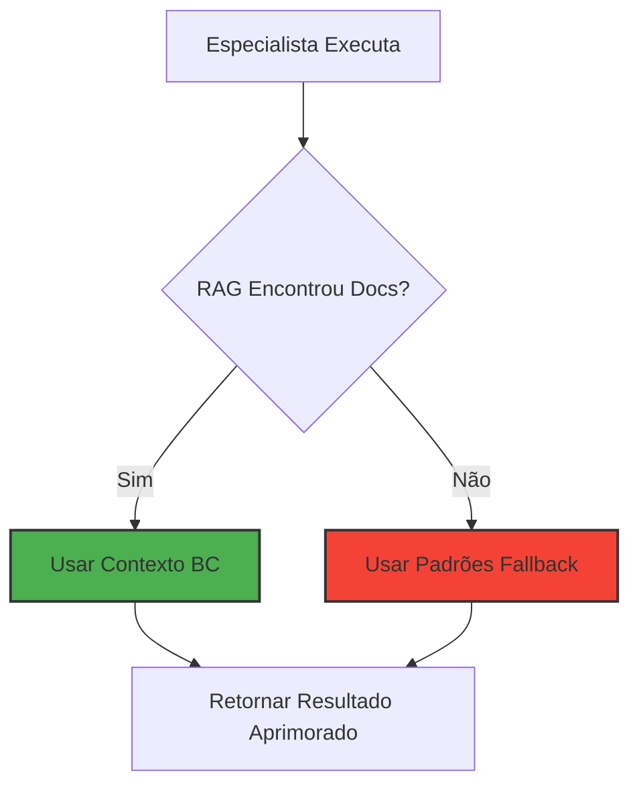

**Degradação Graciosa:**
- Agent sempre tenta RAG primeiro para conhecimento específico
- Se RAG falha, usa padrões fallback hardcoded
- Sistema nunca falha completamente
- Todos os especialistas têm lógica fallback

---

## Princípios Chave da Arquitetura

**1. Arquitetura Limpa** - Dependências fluem para dentro, domínio protegido

**2. RAG-First** - Sempre tenta base de conhecimento, fallback se necessário

**3. Degradação Graciosa** - Sistema funciona mesmo se componentes falharem

**4. Saída Profissional** - Sem emojis, estruturada, acionável

**5. Testabilidade** - 136 testes passando (100% cobertura core)

---

## Próximos Passos

- **[Visão Geral dos Especialistas](../specialists/overview.md)** - Todos os 7 especialistas detalhados
- **[Exemplos](../examples/basic.md)** - Exemplos práticos de código
- **[Arquitetura Limpa](clean-architecture.md)** - Responsabilidades das camadas
- **[Guia de Deploy](../deployment/quickstart.md)** - Deploy no Databricks
