# Arquitetura & Fluxo do Agent

Esta página fornece diagramas visuais explicando como o DPL Agent funciona internamente.

---

## O Que é LangGraph?

**LangGraph** é um framework da LangChain para construir **aplicações multi-agent com estado** usando grafos direcionados.

### Conceito Core

LangGraph modela aplicações AI como um **grafo de estados** onde:
- **Nós** são funções que processam o estado (ex: especialistas, LLM calls)
- **Arestas** definem transições entre nós (ex: roteamento, condicionais)
- **Estado** é compartilhado e modificado ao longo do fluxo

### Por Que Usar LangGraph vs LangChain Puro?

| LangChain (Chains) | LangGraph (Graphs) |
|--------------------|-------------------|
| Fluxo linear sequencial | Fluxo com ciclos e condicionais |
| Difícil adicionar loops | Loops nativos (ex: retry, refinement) |
| Estado implícito | Estado explícito e controlado |
| Hard-coded routing | Dynamic routing baseado em estado |

### Como Funciona no DPL Agent

```python
# Definição simplificada do grafo
from langgraph.graph import StateGraph

# 1. Definir o estado compartilhado
class AgentState(TypedDict):
    messages: List[Message]
    specialist: str
    context: str

# 2. Criar grafo com nós (funções)
workflow = StateGraph(AgentState)
workflow.add_node("router", route_to_specialist)
workflow.add_node("troubleshooter", troubleshoot_specialist)
workflow.add_node("performance", performance_specialist)

# 3. Definir transições (arestas)
workflow.add_conditional_edges(
    "router",
    lambda state: state["specialist"],  # Decisão dinâmica
    {
        "troubleshooter": "troubleshooter",
        "performance": "performance"
    }
)

# 4. Compilar grafo
agent = workflow.compile()
```

### Benefícios para o DPL Agent

1. **Roteamento Dinâmico**: Seleciona especialista baseado na intenção do usuário
2. **Conversas Multi-turno**: Mantém contexto entre interações
3. **Retry e Validação**: Pode refazer passos se resposta inadequada
4. **Debugging**: Estado explícito facilita rastreamento

### Alternativas Consideradas

- **LangChain LCEL**: Bom para pipelines simples, limitado para decisões complexas
- **Custom Orchestration**: Mais flexível mas requer implementar gerenciamento de estado
- **AutoGPT/BabyAGI**: Muito autônomo, difícil de controlar

**Escolha:** LangGraph oferece o melhor equilíbrio entre flexibilidade e controle.

### Visualização do Grafo DPL Agent

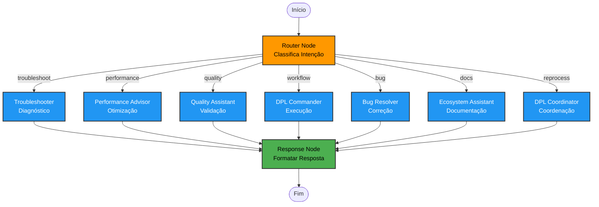

**Componentes do Grafo:**
- **START**: Recebe consulta do usuário
- **ROUTER**: Nó decisor que classifica intenção (conditional edge)
- **Especialistas (7 nós)**: Cada um processa tipos específicos de consultas
- **RESPOND**: Formata resposta final
- **END**: Retorna para o usuário

**Estado compartilhado entre nós:**
```python
{
    "messages": [...],           # Histórico da conversa
    "specialist": "troubleshoot", # Especialista selecionado
    "context": "...",            # Contexto RAG recuperado
    "pipeline_info": {...}       # Metadados do pipeline
}
```

---

## Arquitetura de Alto Nível

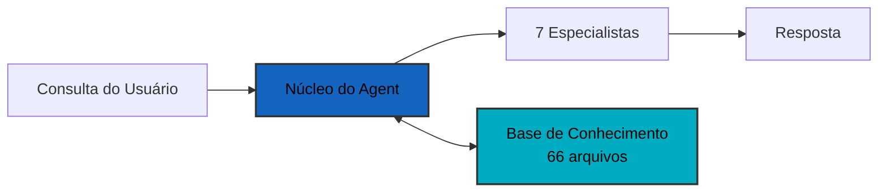

**Componentes:**
- **Núcleo do Agent**: Orquestração LangGraph + sistema RAG
- **7 Especialistas**: Troubleshooter, Bug Resolver, Performance, Quality, Commander, Ecosystem, Coordinator
- **Base de Conhecimento**: 66 arquivos markdown com documentação DPL

---

## Fluxo de Execução do Agent

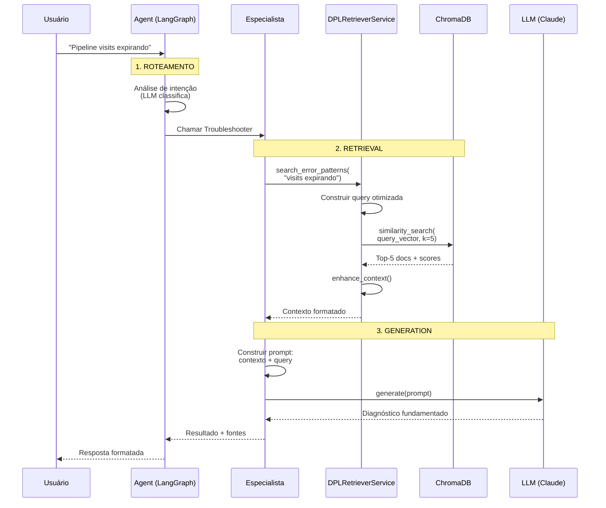

**Etapas Detalhadas:**

1. **Roteamento**: Agent classifica intenção e seleciona especialista apropriado
2. **Retrieval**: Especialista busca documentação relevante via RAG (embeddings + similaridade)
3. **Generation**: LLM gera resposta baseada no contexto recuperado
4. **Resposta**: Inclui diagnóstico + citações das fontes consultadas

**Pontos Importantes:**

- **LLM usado 2x**: No Agent (classificação) e no Especialista (geração)
- **RAG no Especialista**: Cada especialista chama `DPLRetrieverService` automaticamente
- **Contexto flui**: ChromaDB → Retriever → Especialista → LLM → Usuário

---

## Sistema RAG (Retrieval-Augmented Generation)

### Arquitetura Completa em 3 Fases

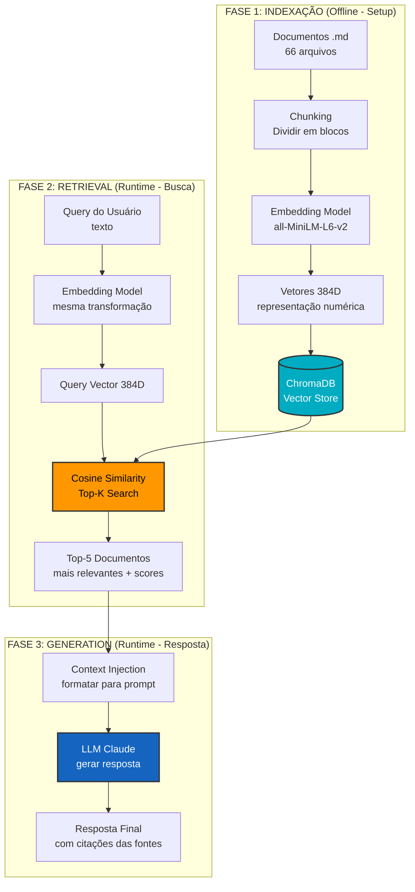

### Componentes Técnicos Explicados

**1. Embedding Model (Sentence Transformers)**
- Converte texto em vetores numéricos de 384 dimensões
- Textos semanticamente similares → vetores próximos no espaço vetorial
- Modelo: `all-MiniLM-L6-v2` (rápido, leve, 80MB)

**2. Vector Database (ChromaDB)**
- Armazena embeddings dos 66 documentos da base de conhecimento
- Busca eficiente usando índices aproximados (HNSW algorithm)
- Persiste em disco para reuso entre execuções

**3. Similarity Search (Cosine)**
- Calcula similaridade entre query vector e document vectors
- Métrica: Cosine Similarity (0 = totalmente diferente, 1 = idêntico)
- Retorna Top-K documentos mais similares (default K=5)

**4. Context Injection**
- Formata documentos recuperados em texto estruturado
- Injeta no prompt do LLM com instruções específicas
- Garante resposta fundamentada em documentação real

**5. LLM Generation (Claude)**
- Recebe: contexto recuperado + query original + instruções
- Gera: resposta baseada APENAS no contexto fornecido
- Inclui: citações das fontes consultadas

---

## Camadas de Arquitetura Limpa

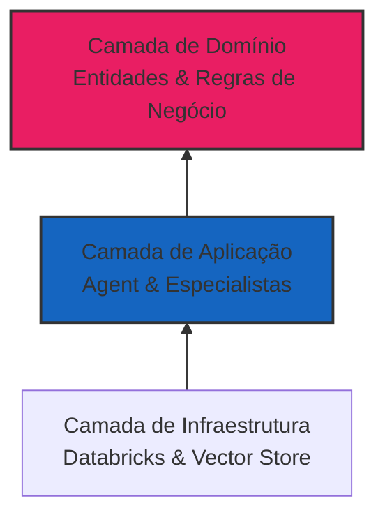

**Camadas (Interna para Externa):**
1. **Domínio**: Lógica de negócio central (entidades DPL, workflows)
2. **Aplicação**: Orquestração do agent, especialistas, RAG
3. **Infraestrutura**: Sistemas externos (Databricks, Claude, ChromaDB)

**Regra**: Dependências fluem apenas para dentro (camadas externas dependem das internas)

---

## Processo de Execução do Especialista

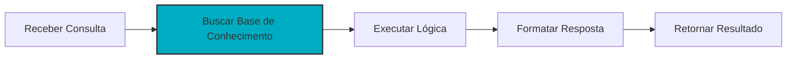

**Processo:**
1. **Receber Consulta**: Obter pergunta do usuário
2. **Buscar BC**: Encontrar documentação relevante (RAG)
3. **Executar Lógica**: Aplicar expertise do especialista
4. **Formatar**: Saída profissional e estruturada
5. **Retornar**: De volta ao núcleo do agent

---

## Estados do Workflow do Agent

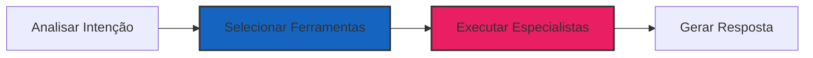

**Estados:**
- **Analisar**: Entender objetivo do usuário (troubleshooting? otimização?)
- **Selecionar**: Escolher especialistas apropriados
- **Executar**: Executar especialistas selecionados em paralelo se necessário
- **Gerar**: Criar resposta final formatada

---

## Seleção de Ferramenta por Intenção

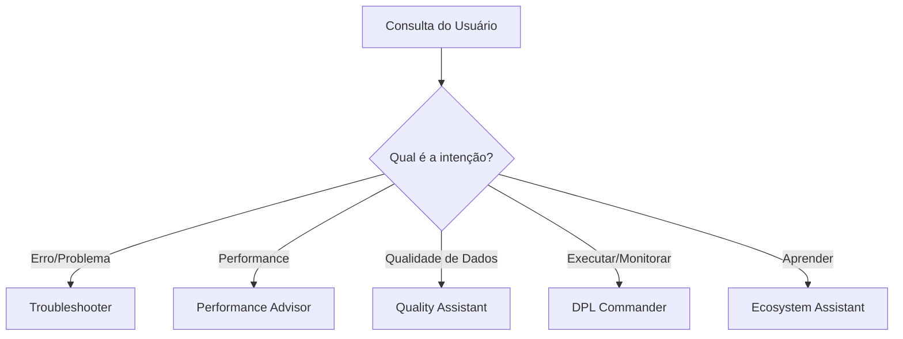

**Categorias de Intenção:**
- **Erro/Problema**: Usa Troubleshooter + Bug Resolver
- **Performance**: Usa Performance Advisor
- **Qualidade de Dados**: Usa Quality Assistant
- **Executar/Monitorar**: Usa DPL Commander
- **Aprender/Explicar**: Usa Ecosystem Assistant

---

## Memória de Conversa

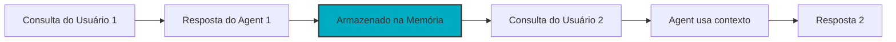

**Como a Memória Funciona:**
- Cada conversa tem um `session_id`
- Agent armazena todas as interações no SQLite
- Perguntas de acompanhamento usam contexto anterior
- Permite conversas multi-turno

---

## Resumo dos 7 Especialistas

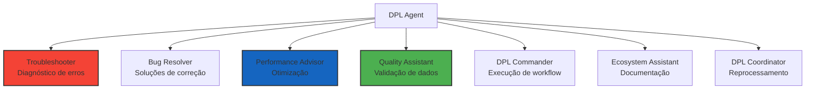

**Todos os 7 Especialistas:**
1. **Troubleshooter**: Diagnosticar erros e problemas
2. **Bug Resolver**: Fornecer correções passo a passo
3. **Performance Advisor**: Otimizar performance de pipeline
4. **Quality Assistant**: Validar qualidade de dados
5. **DPL Commander**: Executar e monitorar workflows
6. **Ecosystem Assistant**: Explicar componentes DPL
7. **DPL Coordinator**: Coordenar cenários de reprocessamento

---

## Deploy no Databricks

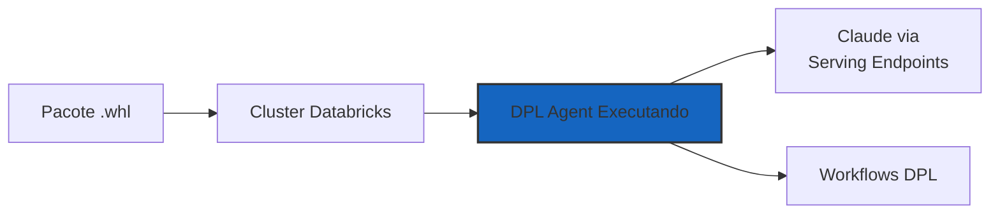

**Etapas de Deploy:**
1. Build do pacote `.whl` (data_pipeline_agent_lib-3.1.0)
2. Upload para cluster Databricks
3. Import e uso em notebooks
4. Agent usa endpoints Claude do Databricks
5. Interage com workflows DPL

**Sem Chaves API Externas Necessárias** - Usa serviços nativos do Databricks

---

## Tratamento de Erros & Fallback

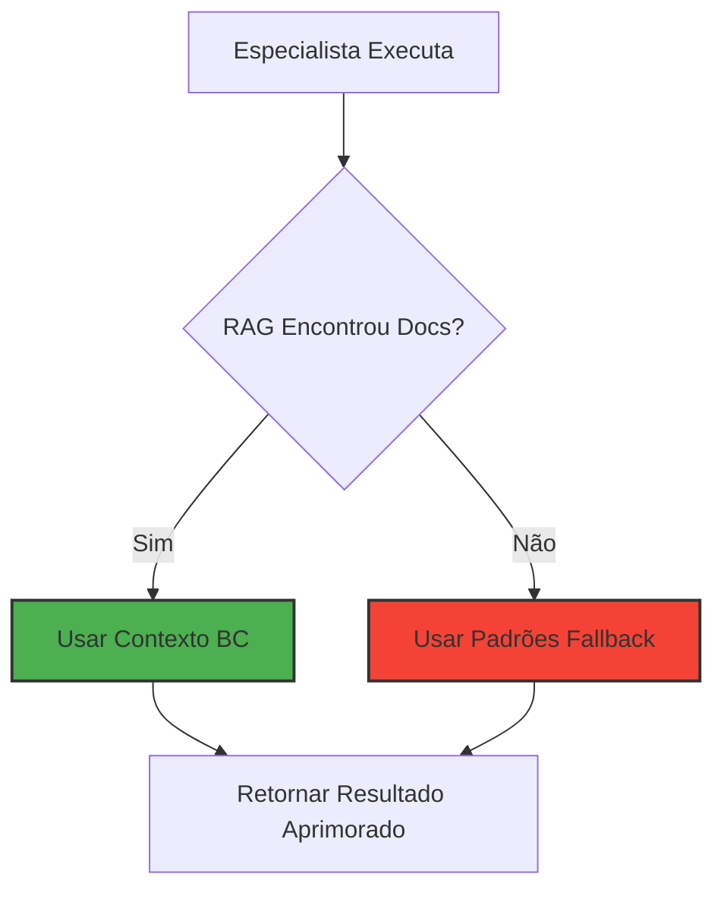

**Degradação Graciosa:**
- Agent sempre tenta RAG primeiro para conhecimento específico
- Se RAG falha, usa padrões fallback hardcoded
- Sistema nunca falha completamente
- Todos os especialistas têm lógica fallback

---

## Princípios Chave da Arquitetura

**1. Arquitetura Limpa** - Dependências fluem para dentro, domínio protegido

**2. RAG-First** - Sempre tenta base de conhecimento, fallback se necessário

**3. Degradação Graciosa** - Sistema funciona mesmo se componentes falharem

**4. Saída Profissional** - Sem emojis, estruturada, acionável

**5. Testabilidade** - 136 testes passando (100% cobertura core)

---

## Próximos Passos

- **[Visão Geral dos Especialistas](../specialists/overview.md)** - Todos os 7 especialistas detalhados
- **[Exemplos](../examples/basic.md)** - Exemplos práticos de código
- **[Arquitetura Limpa](clean-architecture.md)** - Responsabilidades das camadas
- **[Guia de Deploy](../deployment/quickstart.md)** - Deploy no Databricks
