# Agent Architecture & Flow

This page provides visual diagrams explaining how the DPL Agent works internally.

---

## High-Level Architecture

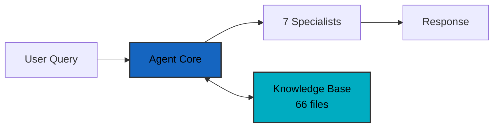

**Components:**
- **Agent Core**: LangGraph orchestration + RAG system
- **7 Specialists**: Troubleshooter, Bug Resolver, Performance, Quality, Commander, Ecosystem, Coordinator
- **Knowledge Base**: 66 markdown files with DPL documentation

---

## Agent Execution Flow

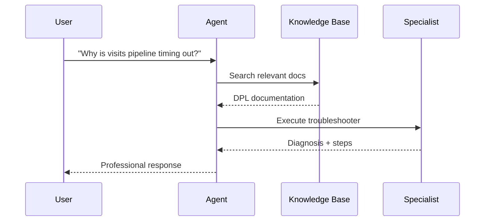

**Steps:**
1. User asks question
2. Agent searches knowledge base for context
3. Agent selects and executes appropriate specialist
4. Specialist provides diagnosis with sources
5. Agent returns formatted response

---

## RAG System (Knowledge Retrieval)

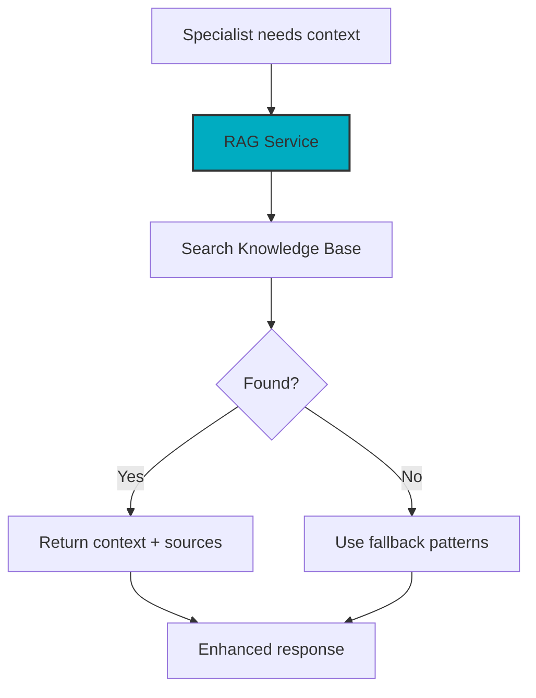

**How it works:**
- Specialists query the RAG service for relevant documentation
- RAG searches 66 markdown files using semantic search
- Returns context with sources if found
- Falls back to hardcoded patterns if not found

---

## Clean Architecture Layers

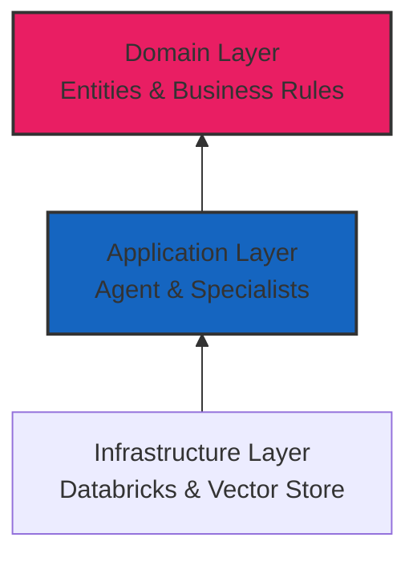

**Layers (Inner to Outer):**
1. **Domain**: Core business logic (DPL entities, workflows)
2. **Application**: Agent orchestration, specialists, RAG
3. **Infrastructure**: External systems (Databricks, Claude, ChromaDB)

**Rule**: Dependencies flow inward only (outer layers depend on inner)

---

## Specialist Execution Process

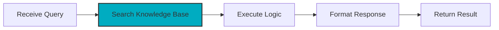

**Process:**
1. **Receive Query**: Get user question
2. **Search KB**: Find relevant documentation (RAG)
3. **Execute Logic**: Apply specialist expertise
4. **Format**: Professional, structured output
5. **Return**: Back to agent core

---

## Agent Workflow States

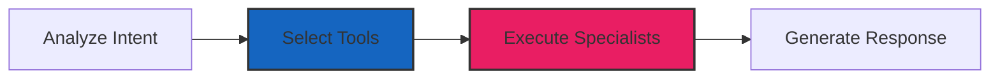

**States:**
- **Analyze**: Understand user's goal (troubleshooting? optimization?)
- **Select**: Choose appropriate specialists
- **Execute**: Run selected specialists in parallel if needed
- **Generate**: Create final formatted response

---

## Tool Selection by Intent

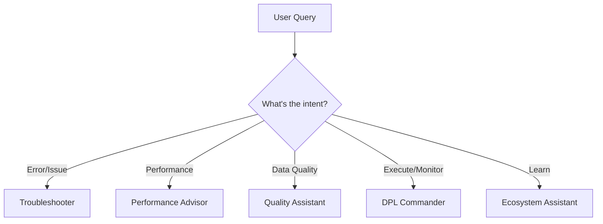

**Intent Categories:**
- **Error/Issue**: Uses Troubleshooter + Bug Resolver
- **Performance**: Uses Performance Advisor
- **Data Quality**: Uses Quality Assistant
- **Execute/Monitor**: Uses DPL Commander
- **Learn/Explain**: Uses Ecosystem Assistant

---

## Conversation Memory

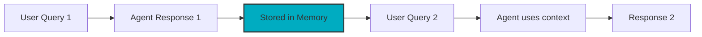

**How Memory Works:**
- Each conversation has a `session_id`
- Agent stores all interactions in SQLite
- Follow-up questions use previous context
- Enables multi-turn conversations

---

## 7 Specialists Summary

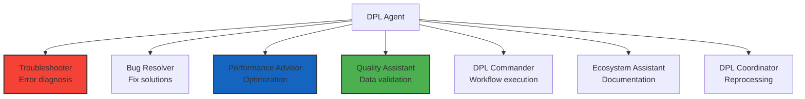

**All 7 Specialists:**
1. **Troubleshooter**: Diagnose errors and issues
2. **Bug Resolver**: Provide step-by-step fixes
3. **Performance Advisor**: Optimize pipeline performance
4. **Quality Assistant**: Validate data quality
5. **DPL Commander**: Execute and monitor workflows
6. **Ecosystem Assistant**: Explain DPL components
7. **DPL Coordinator**: Coordinate reprocessing scenarios

---

## Databricks Deployment

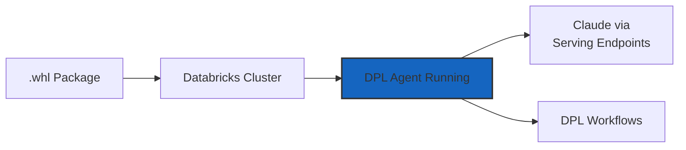

**Deployment Steps:**
1. Build `.whl` package (data_pipeline_agent_lib-3.1.0)
2. Upload to Databricks cluster
3. Import and use in notebooks
4. Agent uses Databricks Claude endpoints
5. Interacts with DPL workflows

**No External API Keys Required** - Uses Databricks native services

---

## Error Handling & Fallback

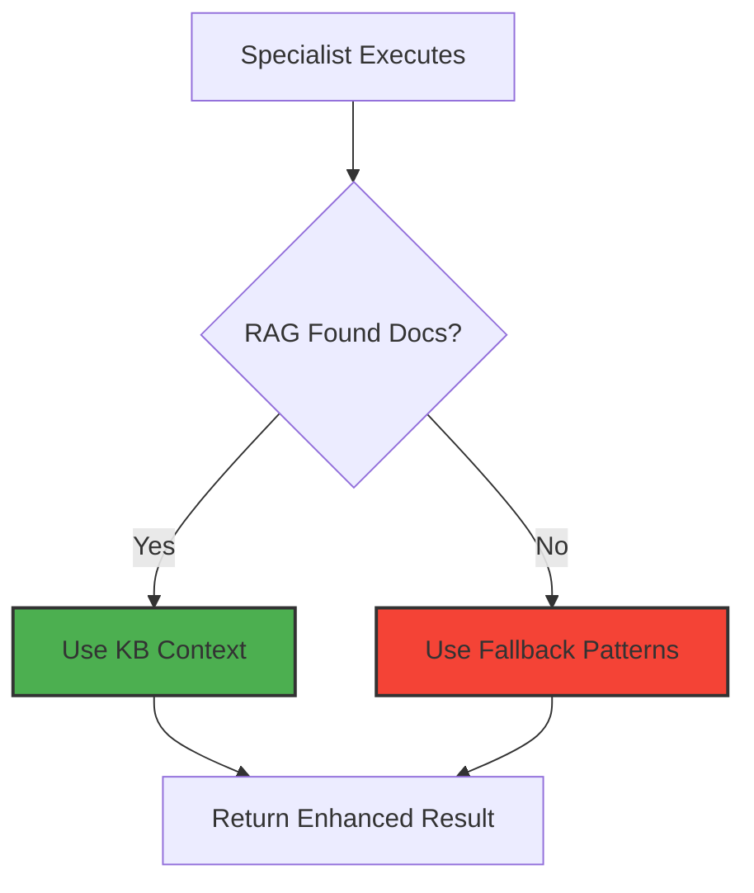

**Graceful Degradation:**
- Agent always tries RAG first for specific knowledge
- If RAG fails, uses hardcoded fallback patterns
- System never fails completely
- All specialists have fallback logic

---

## Key Architecture Principles

**1. Clean Architecture** - Dependencies flow inward, domain protected

**2. RAG-First** - Always try knowledge base, fallback if needed

**3. Graceful Degradation** - System works even if components fail

**4. Professional Output** - No emojis, structured, actionable

**5. Testability** - 136 tests passing (100% core coverage)

---

## Next Steps

- **[Specialists Overview](../specialists/overview.md)** - All 7 specialists detailed
- **[Examples](../examples/basic.md)** - Practical code examples
- **[Clean Architecture](clean-architecture.md)** - Layer responsibilities
- **[Deployment Guide](../deployment/quickstart.md)** - Deploy to Databricks

