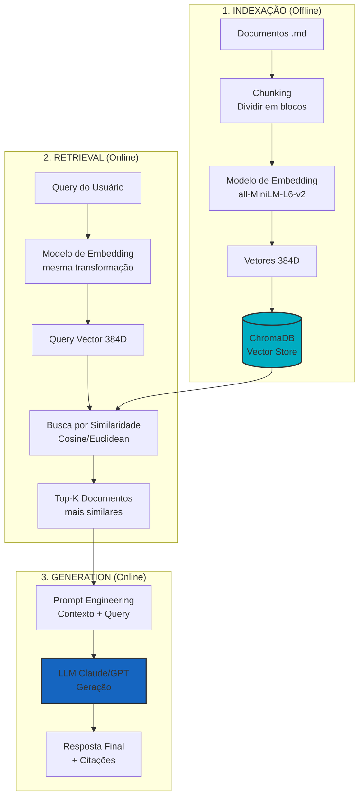
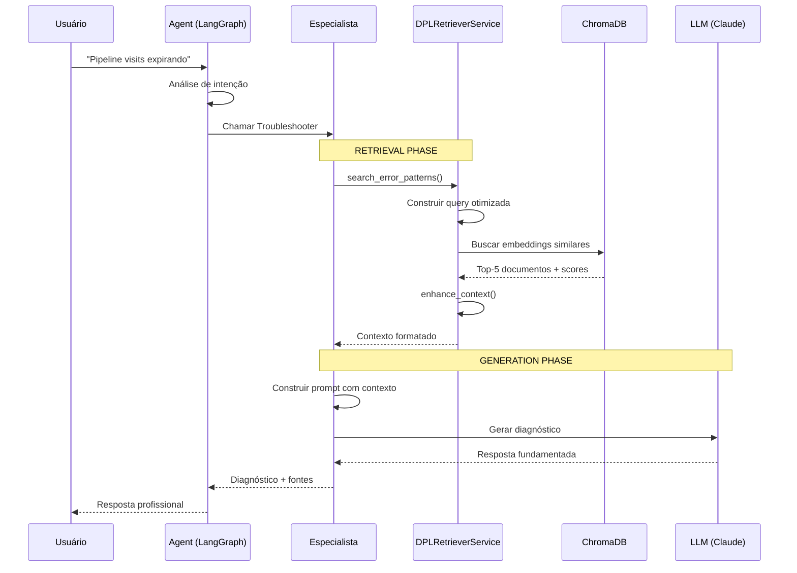

# RAG (Retrieval-Augmented Generation) - Explicação Completa

**Última Atualização**: 2025-10-05  
**Versão**: 1.0

---

## O Que é RAG?

**RAG** (Retrieval-Augmented Generation) é uma arquitetura de IA que **combina recuperação de informação com geração de texto** para criar respostas mais precisas e fundamentadas.

### Conceito Core

```
RAG = Retrieval (Recuperação) + Augmented (Aumentada) + Generation (Geração)
```

**Em termos simples**:
1. **Retrieval**: Busca documentos relevantes em uma base de conhecimento
2. **Augmented**: Usa esses documentos para "aumentar" o conhecimento do LLM
3. **Generation**: O LLM gera a resposta baseada no contexto recuperado

---

## Por Que Usar RAG?

### Problema dos LLMs Puros

| Limitação | Impacto |
|-----------|---------|
| Conhecimento congelado no treinamento | Dados desatualizados, não conhece info recente |
| "Alucinações" (inventar fatos) | Respostas incorretas que parecem plausíveis |
| Sem dados específicos da empresa | Não conhece workflows, processos internos |
| Context window limitado | Não consegue processar toda documentação |

### Solução com RAG

| Benefício | Como Funciona |
|-----------|---------------|
| **Conhecimento atualizado** | Base de conhecimento pode ser atualizada sem retreinar |
| **Respostas fundamentadas** | Sempre baseadas em documentos reais (citações) |
| **Conhecimento especializado** | Integra documentação proprietária da empresa |
| **Eficiência de contexto** | Recupera apenas o que é relevante |

---

## Arquitetura RAG Completa

### Fluxo End-to-End



---

## Componentes Técnicos Detalhados

### 1. Indexação da Base de Conhecimento

**O que acontece**: Documentos são convertidos em vetores numéricos (embeddings).

```python
# Exemplo simplificado
from sentence_transformers import SentenceTransformer

# 1. Carregar modelo de embedding
model = SentenceTransformer('all-MiniLM-L6-v2')

# 2. Documentos da base de conhecimento
docs = [
    "Pipeline streaming usa Event Hub para ingestão...",
    "Timeout em workflows pode indicar falta de recursos...",
    "Quality checks incluem validação de completude..."
]

# 3. Converter cada documento em vetor
embeddings = model.encode(docs)
# embeddings.shape = (3, 384)  # 3 docs, 384 dimensões cada

# 4. Armazenar no vector store
vector_store.add(documents=docs, embeddings=embeddings)
```

**Resultado**: Cada documento vira um vetor de 384 números (floats).

---

### 2. Busca Semântica (Retrieval)

**O que acontece**: Query do usuário é convertida no mesmo espaço vetorial, e documentos mais próximos são recuperados.

```python
# 1. Query do usuário
user_query = "Como resolver timeout no pipeline visits?"

# 2. Converter query em vetor (mesmo modelo!)
query_vector = model.encode([user_query])
# query_vector.shape = (1, 384)

# 3. Buscar documentos similares usando cosine similarity
results = vector_store.similarity_search(
    query_embedding=query_vector,
    k=5  # Top 5 mais similares
)

# 4. Resultados ordenados por relevância
for doc, score in results:
    print(f"Score: {score:.3f} - {doc[:100]}...")
```

**Métricas de Similaridade**:
- **Cosine Similarity**: Mede ângulo entre vetores (-1 a 1)
- **Euclidean Distance**: Distância geométrica no espaço 384D
- **Dot Product**: Produto escalar dos vetores

---

### 3. Geração com Contexto (Augmented Generation)

**O que acontece**: Documentos recuperados são injetados no prompt do LLM.

```python
# 1. Construir prompt com contexto recuperado
context = "\n\n".join([doc.content for doc in results])

prompt = f"""
Você é um especialista em pipelines DPL no Databricks.
Use APENAS as informações abaixo para responder.

=== CONTEXTO DA BASE DE CONHECIMENTO ===
{context}

=== PERGUNTA DO USUÁRIO ===
{user_query}

=== INSTRUÇÕES ===
- Responda baseado APENAS no contexto fornecido
- Cite as fontes usadas
- Se não houver informação suficiente, diga claramente
"""

# 2. Enviar para LLM
response = llm.invoke(prompt)

# 3. LLM gera resposta fundamentada no contexto
print(response)
```

**Resultado**: Resposta baseada em documentação real, não em "conhecimento geral" do LLM.

---

## Implementação no DPL Agent

### Arquitetura Específica



### Código Real do Projeto

**1. Serviço de Retrieval** (`dpl_retriever_service.py`):

```python
class DPLRetrieverService:
    def search_error_patterns(
        self,
        error_message: str,
        entity_name: Optional[str] = None,
        top_k: int = 5
    ) -> List[Dict[str, Any]]:
        """
        Busca padrões de erro similares usando embeddings.
        
        Returns:
            [
                {
                    "content": "Pipeline streaming timeout...",
                    "score": 0.89,
                    "source": "troubleshooting/streaming.md",
                    "metadata": {...}
                },
                ...
            ]
        """
        # 1. Construir query otimizada
        query = f"Error troubleshooting: {error_message}"
        if entity_name:
            query += f" entity: {entity_name}"
        
        # 2. Busca vetorial
        results = self.retriever.search(query, top_k=top_k)
        
        return results
```

**2. Uso no Especialista**:

```python
def troubleshoot_hdl_error(error_message: str) -> str:
    # 1. Recuperar contexto via RAG
    retriever_service = get_hdl_retriever_service()
    docs = retriever_service.search_error_patterns(
        error_message=error_message,
        top_k=5
    )
    
    # 2. Aumentar contexto
    context = retriever_service.enhance_context(docs)
    
    # 3. Gerar diagnóstico com LLM
    prompt = f"""
    {context}
    
    Diagnostique o seguinte erro:
    {error_message}
    """
    
    diagnosis = llm.invoke(prompt)
    return diagnosis
```

---

## Stack Técnica do RAG

### Componentes Usados

| Componente | Tecnologia | Função |
|------------|-----------|--------|
| **Embedding Model** | `all-MiniLM-L6-v2` | Converte texto → vetores 384D |
| **Vector Database** | ChromaDB | Armazena e busca embeddings |
| **Similarity Metric** | Cosine Similarity | Calcula relevância |
| **LLM** | Claude 3.5 Sonnet | Gera respostas finais |
| **Orchestration** | LangChain/LangGraph | Coordena fluxo RAG |

### Parâmetros de Configuração

```python
# Configuração do vector store
vector_store = ChromaDB(
    collection_name="dpl_knowledge",
    embedding_function=SentenceTransformerEmbeddings(
        model_name="all-MiniLM-L6-v2"
    ),
    persist_directory="./chroma_db"
)

# Configuração da busca
retriever = vector_store.as_retriever(
    search_type="similarity",      # ou "mmr" (maximal marginal relevance)
    search_kwargs={
        "k": 5,                     # Top-5 resultados
        "score_threshold": 0.7      # Mínimo de similaridade
    }
)
```

---

## Métricas de Qualidade RAG

### Métricas de Retrieval

- **Precision@K**: % de documentos relevantes nos Top-K
- **Recall**: % de docs relevantes que foram recuperados
- **MRR** (Mean Reciprocal Rank): Posição do primeiro resultado relevante

### Métricas de Generation

- **Faithfulness**: Resposta é fiel ao contexto recuperado?
- **Answer Relevance**: Resposta é relevante para a query?
- **Context Precision**: Contexto recuperado era relevante?

---

## Técnicas Avançadas

### 1. Hybrid Search

Combina busca vetorial (semântica) com busca por keywords (BM25):

```python
# Recuperar usando ambos métodos
semantic_results = vector_store.similarity_search(query, k=10)
keyword_results = bm25_search(query, k=10)

# Combinar com pesos
final_results = rerank(
    semantic_results * 0.7 + keyword_results * 0.3
)
```

### 2. Re-ranking

Refinar resultados com modelo mais sofisticado:

```python
# 1. Busca inicial (rápida)
candidates = vector_store.search(query, k=20)

# 2. Re-ranking com cross-encoder (mais preciso, mais lento)
reranker = CrossEncoder('ms-marco-MiniLM-L-6-v2')
scores = reranker.predict([(query, doc) for doc in candidates])
final_docs = sort_by_scores(candidates, scores)[:5]
```

### 3. Query Expansion

Reformular query para melhor recuperação:

```python
# Gerar variações da query
expanded_query = llm.invoke(f"""
Gere 3 reformulações desta pergunta:
{original_query}
""")

# Buscar usando todas as variações
results = []
for q in expanded_query:
    results.extend(vector_store.search(q, k=3))

# Deduplicate e ranquear
final_results = deduplicate_and_rank(results)
```

---

## Limitações e Desafios

### Limitações Conhecidas

| Problema | Impacto | Mitigação |
|----------|---------|-----------|
| **Chunking ruins** | Contexto fragmentado | Usar chunks semânticos, não fixos |
| **Query-doc mismatch** | Recuperação pobre | Query expansion, hybrid search |
| **Docs irrelevantes** | LLM confuso | Re-ranking, threshold de similaridade |
| **Context overflow** | Excede limite do LLM | Compression, summarization |

### Desafios Técnicos

1. **Cold Start**: Base de conhecimento vazia inicialmente
2. **Drift**: Embeddings podem ficar desatualizados
3. **Multilingual**: Precisa embeddings multilíngues
4. **Latência**: Busca vetorial + LLM = 2-5 segundos

---

## Próximos Passos

### Melhorias Planejadas

- [ ] **Metadata Filtering**: Filtrar por tipo, data, pipeline antes da busca
- [ ] **Hybrid Search**: Combinar busca semântica com keywords
- [ ] **Query Decomposition**: Quebrar perguntas complexas em sub-queries
- [ ] **Feedback Loop**: Usar feedback do usuário para melhorar retrieval

### Recursos Adicionais

- [LangChain RAG Tutorial](https://python.langchain.com/docs/use_cases/question_answering/)
- [ChromaDB Documentation](https://docs.trychroma.com/)
- [Sentence Transformers](https://www.sbert.net/)

---

**Autor**: Victor Cappelletto  
**Versão**: 1.0  
**Data**: 2025-10-05


